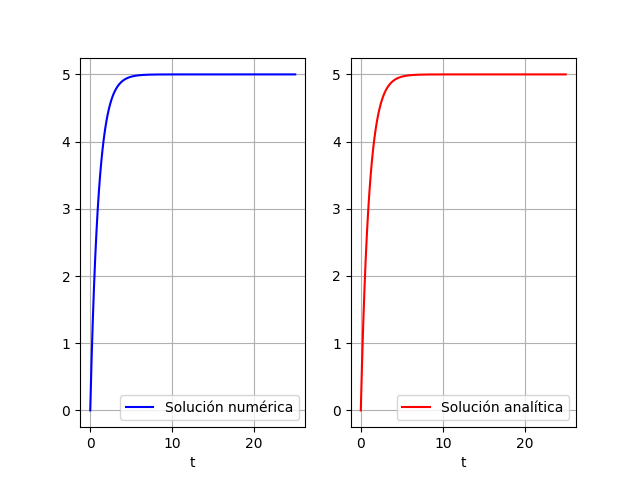

# Ejercicio 1

## Modelo matemático

$$
\frac{dy}{dt} = -y + 5; \quad y(0) = 0
$$

## Resolución analítica

Usaremos separación de variables.

$$
\begin{split}
\frac{1}{-y + 5}dy &= dt \\
\int \frac{1}{-y + 5}dy &= \int dt \\
-Ln(-y + 5) &= t + C_1 \\
Ln(-y + 5) &= -t + C_2 \\
y &= 5 - Ce^{-t} \\
0 &= 5 - C \\
C &= 5 \\
\end{split}
$$

$$
\therefore \quad \underline{y(t) = 5 - 5e^{-t}}
$$

## Resolución numérica

```{.python include="src/assets/ejercicio1.py"}
```

{height=50%}

\newpage
