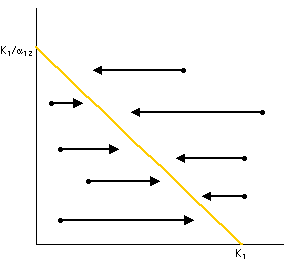
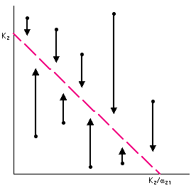
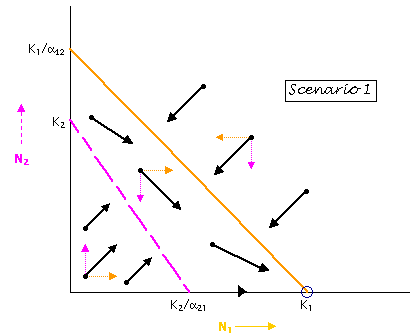
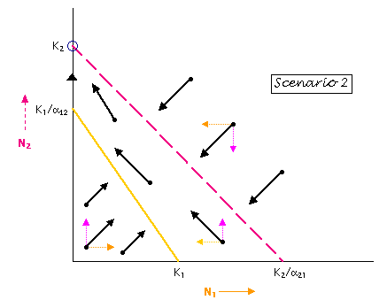
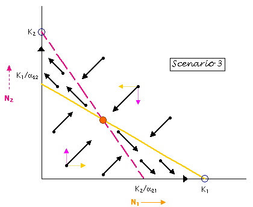
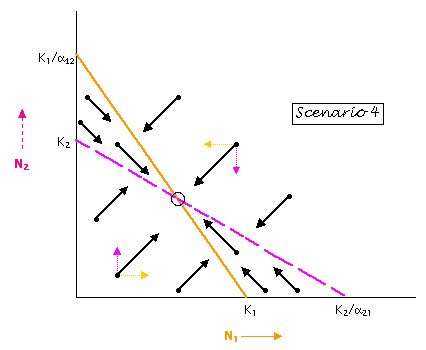

# Modelo de competencia

Analizaremos un modelo de competencia entre dos especies $N_1$ e $N_2$ que
crecen siguiendo la ecuación logística.

## Modelo matemático

$$
\begin{split}
N_1' &= r_1N_1\left(1 - \frac{N_1}{k_1}\right) - \frac{\beta_1r_1}{k_1}N_1N_2 =
r_1N_1\frac{(k_1 - N_1 - \beta_1N_2)}{k_1} \\
N_2' &= r_2N_2\left(1 - \frac{N_2}{k_2}\right) - \frac{\beta_2r_2}{k_2}N_1N_2 =
r_2N_2\frac{(k_2 - N_2 - \beta_2N_1)}{k_2} \\
\end{split}
$$

## Análisis cualitativo

### Isoclinas

Hallemos las isoclinas de nuestro sistema.

- Para $N_1' = 0$

$$
\begin{split}
r_1N_1\frac{(k_1 - N_1 - \beta_1N_2)}{k_1} &= 0 \\
N_1(k_1 - N_1 - \beta_1N_2) &= 0 \\
N_1 = 0 \quad \lor \quad k_1 - N_1 - \beta_1N_2 &= 0 \\
N_1 = 0 \quad \lor \quad \frac{N_1}{k_1} + \frac{N_2}{\frac{k_1}{\beta_1}} = 1
\end{split}
$$

- Para $N_2' = 0$

$$
\begin{split}
r_2N_2\frac{(k_2 - N_2 - \beta_2N_1)}{k_2} &= 0 \\
N_2(k_2 - N_2 - \beta_2N_1) &= 0 \\
N_2 = 0 \quad \lor \quad k_2 - N_2 - \beta_2N_1 &= 0 \\
N_2 = 0 \quad \lor \quad \frac{N_1}{\frac{k_2}{\beta_2}} + \frac{N_2}{k_2} = 1
\end{split}
$$

Por lo tanto, obtuvimos cuatro isoclinas. Dos por cada una de las variables.
Ahora, hallemos los puntos críticos.

### Puntos críticos

Previamente, hemos calculado curvas donde las derivada de cada variable se
anulan. Podemos encontrar los puntos críticos intersectando dichas curvas.
Lo cual nos da cuatro casos.

$$
(0, 0) \quad (0, k_2) \quad (k_1, 0) \quad (N_1^*, N_2^*)
$$

Donde:

- $N_1^*, N_2^*$ es la intersección de $k_1 - N_1 - \beta_1N_2 = 0$ y
$k_2 - N_2 - \beta_2N_1 = 0$.

### Análisis geométrico

Para entender mejor el modelo, haremos un análisis geométrico. Primero,
analizaremos la dirección de la derivada para cada una de las variables.

Para la variable $N_1$ se tiene que $N_1' > 0$ cuando
$\frac{N_1}{k_1} + \frac{N_2}{\frac{k_1}{\beta_1}} < 0$, y que $N_1' < 0$ cuando
$N_1' < 0$, $\frac{N_1}{k_1} + \frac{N_2}{\frac{k_1}{\beta_1}} > 0$. De manera
similar para $N_2$.

Ahora analizaremos los escenarios que corresponden a distintas configuraciones
de los parámetros.

Los primeros dos escenarios ocurren cuando la capacidad de carga de una de las
especies es mayor al cociente entre la capacidad de carga de la otra especie
sobre el coeficiente de competición y lo contrario para la otra especie. Por
ejemplo, para el escenario 1, $k_2 < \frac{k_1}{\beta_1}$ y
$\frac{k_2}{\beta_2} < k_1$.

{height=35%}

{height=35%}

En el primer y segundo escenario, vemos que los puntos críticos válidos serían
$(0, 0) \quad (0, k_2) \quad (k_1, 0)$. El punto $(0, 0)$ sería un **punto
inestable** ya que cualquier pequeña perturbación alrededor de ese punto hará
que la solución resultante se aleje de dicho punto. De manera similar,
$(0, k_2)$ es un **punto inestable**. Por otro lado, el punto $(k_1, 0)$ es un
**punto estable**, ya que, cualquier perturbación hará que la solución
resultante se acerque a dicho punto. De forma similar, se pueden clasificar
los puntos en el segundo escenario.

Los dos últimos escenarios ocurren cuando las rectas chocan en el punto
$(N_1^*, N_2^*)$, obteniendo así cuatro puntos críticos:
$(0, 0) \quad (0, k_2) \quad (k_1, 0) \quad (N_1^*, N_2^*)$. Estos dos
escenarios tienen comportamientos muy distintos. 

{height=35%}

{height=35%}

En el tercer escenario, los **puntos inestables** serían $(0, 0)$ y
$(N_1^*, N_2^*)$ **(punto silla)**. Los **puntos estables** son $(k_1, 0)$
y $(0, k_2)$. Este es un comportamiento interesante, puesto que, dependiendo
de la población inicial una de las dos poblaciones se extinguirá.

En el cuarto escenario, los **puntos inestables** serían $(0, 0)$, $(k_1, 0)$
y $(0, k_2)$. El **punto estable** es $(N_1^*, N_2^*)$.
Este también es un comportamiento interesante, puesto que, las poblaciones
tienden a la **coexistencia**.

## Conclusiones

- En este trabajo, se utilizó un análisis geométrico para analizar el
comportamiento del sistema bajo distintos escenarios. Este método, a pesar de
no ser tan preciso como el análisis algebraico, brinda una visión general
del comportamiento de las soluciones y los puntos críticos.

