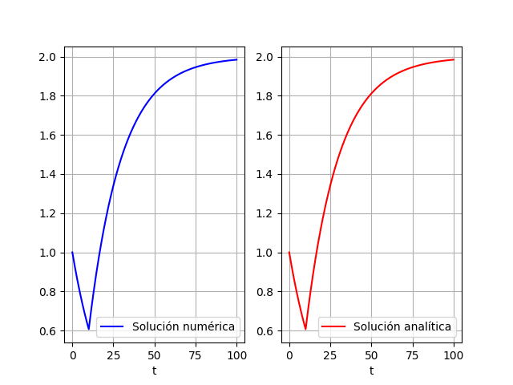

# Ejercicio 2

## Modelo matemático

$$
20\frac{dy}{dt} = -y + p(t); \quad y(0) = 1
$$

Donde:

$$
p(t) =
\begin{cases}
0; & t < 10 \\
2; & 10 \leq t \\
\end{cases}
$$

## Resolución analítica

Notamos que:

$$
p(t) = 2u(t - 10)
$$

Donde:

$u(t)$ es la función escalón unitario

Usaremos la transformada de Laplace.

$$
\begin{split}
20\frac{dy}{dt} &= -y + 2u(t-10) \\
\mathcal{L}\{20\frac{dy}{dt}\} &= \mathcal{L}\{-y + 2u(t-10)\} \\
20(sF(s) - y(0)) &= -F(s) + 2\frac{e^{-10s}}{s} \\
20sF(s) - 20 &= -F(s) + 2\frac{e^{-10s}}{s} \\
(20s + 1)F(s) &= 20 + 2\frac{e^{-10s}}{s} \\
F(s) &= \frac{20s + 2e^{-10s}}{s(20s + 1)} \\
F(s) &= \frac{20}{20s+1} + \frac{2e^{-10s}}{s(20s+1)} \\
F(s) &= \frac{1}{s+\frac{1}{20}} + 2\frac{\frac{1}{20}}
{s(s+\frac{1}{20})}e^{-10s} \\
\end{split}
$$

$$
\therefore \quad
\underline{y(t) = e^{-\frac{1}{20}t} + 2(1 - e^{-\frac{1}{20}(t-10)})u(t-10)}
$$

## Resolución numérica

```{.python include="src/assets/ejercicio2.py"}
```

{height=50%}

\newpage
