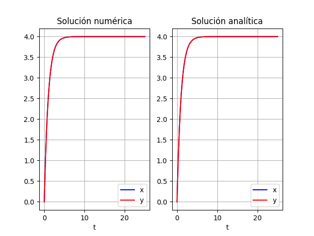

# Ejercicio 3

## Modelo matemático

$$
\left\{
\begin{split}
\frac{dx}{dt} &= 4e^{-t} \\
\frac{dy}{dt} &= 4 - y \\
x(0) &= 0 \\
y(0) &= 0 \\
\end{split}
\right.
$$

## Resolución analítica

Resolveremos para cada variable del sistema de forma independiente.

Para x:

Separación de variables

$$
\begin{split}
dx &= 4e^{-t}dt \\
\int dx &= \int 4e^{-t}dt \\
x &= C - 4e^{-t} \\
0 &= C - 4 \\
C &= 4 \\
\end{split}
$$

$$
\therefore \quad \underline{x(t) = 4 - 4e^{-t}}
$$

Para y:

Separación de variables

$$
\begin{split}
\frac{1}{4-y}dy &= dt \\
\int \frac{1}{4-y}dy &= \int dt \\
-Ln(4-y) &= t + C_1 \\
Ln(4-y) &= -t + C_2 \\
y &= 4 - Ce^{-t} \\
0 &= 4 - C \\
C &= 4 \\
\end{split}
$$

$$
\therefore \quad \underline{y(t) = 4 - 4e^{-t}}
$$

## Resolución numérica

```{.python include="src/assets/ejercicio3.py"}
```

{height=50%}

\newpage
