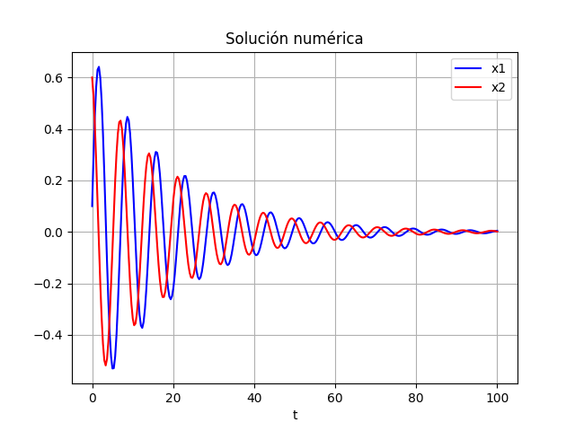

# Ejercicio 4 (Péndulo amortiguado)

## Desarrollo


Consideremos un péndulo simple con masa $m$, longitud $l$ y ángulo $\alpha(t)$ con la vertical.  El péndulo experimenta una fuerza de amortiguamiento proporcional a la velocidad angular $\alpha'(t)$.

\begin{itemize}
    \item \textbf{Fuerzas:}
    \begin{itemize}
        \item Tensión ($T$) a lo largo de la cuerda.
        \item Peso ($mg$) verticalmente hacia abajo.
        \item Fuerza de amortiguamiento ($-b\alpha'$) oponiéndose al movimiento.
    \end{itemize}

    \item \textbf{Descomposición del peso:}
    \begin{itemize}
        \item Componente tangencial: $-mg\sin(\alpha)$ (responsable del movimiento).
        \item Componente radial: $-mg\cos(\alpha)$ (compensada por la tensión).
    \end{itemize}

    \item \textbf{Torque neto ($\tau$):}
    El torque se debe a la componente tangencial del peso y a la fuerza de amortiguamiento:
    $$\tau = -l(mg\sin(\alpha)) - l(b\alpha') = -mgl\sin(\alpha) - bl\alpha'$$

    \item \textbf{Segunda ley de Newton (rotacional):}
    $$\tau = I\alpha''$$
    donde $I = ml^2$ es el momento de inercia para una masa puntual.

    \item \textbf{Combinando las ecuaciones:}
    $$-mgl\sin(\alpha) - bl\alpha' = ml^2\alpha''$$

    \item \textbf{Simplificando:}
    Dividimos por $ml^2$:
    $$\alpha'' + \frac{b}{ml}\alpha' + \frac{g}{l}\sin(\alpha) = 0$$

    \item \textbf{Constantes:}
    Definimos $k_1 = \frac{b}{ml}$ (constante de amortiguamiento) y $k_2 = \frac{g}{l}$ (relacionada con la frecuencia natural).

    \item \textbf{Ecuación final:}
    $$\alpha'' + k_1\alpha' + k_2\sin(\alpha) = 0$$
\end{itemize}

## Modelo matemático

$$
\alpha'' + k_1\alpha' + k_2\sin(\alpha) = 0
$$

## Resolución analítica

Simplifiquemos la EDO de segundo orden a una EDO de primer order pero de
dos dimensiones.

Declaramos dos variables.

$$
\begin{split}
x_1 &= \alpha \\
x_2 &= \alpha' \\
\end{split}
$$

Además, se tiene que:

$$
\begin{split}
x_1' &= \alpha' \\
x_1' &= x_2 \\
x_2' &= -k_1\alpha' - k_2\sin(\alpha) \\
x_2' &= -k_1x_2 - k_2\sin(x_1) \\
\end{split}
$$

Por lo tanto:

$$
\left\{
\begin{split}
x_1' &= x_2 \\
x_2' &= -k_1x_2 - k_2\sin(x_1) \\  
\end{split}
\right.
$$

Debido a que esta es un ecuación diferencial **no lineal** que describe el
movimiento de un péndulo, resolverlo analíticamente requiere funciones
elípticas. Lo cual esta fuera del alcanze de este informe. Por lo que,
procederemos con la resolución numérica.

## Resolución numérica

```{.python include="src/assets/ejercicio4.py"}
```

{height=50%}

\newpage
